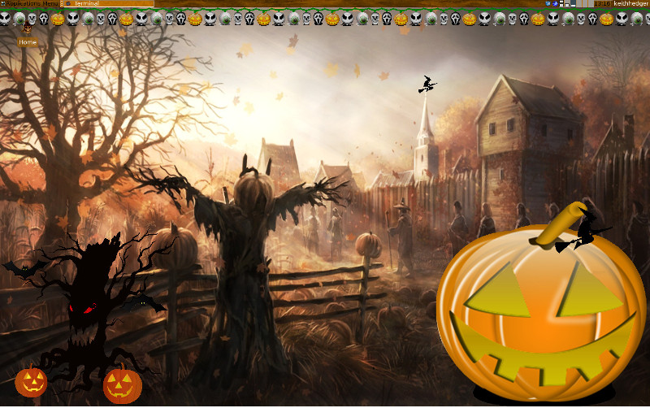
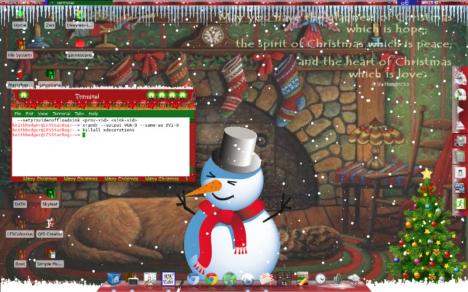
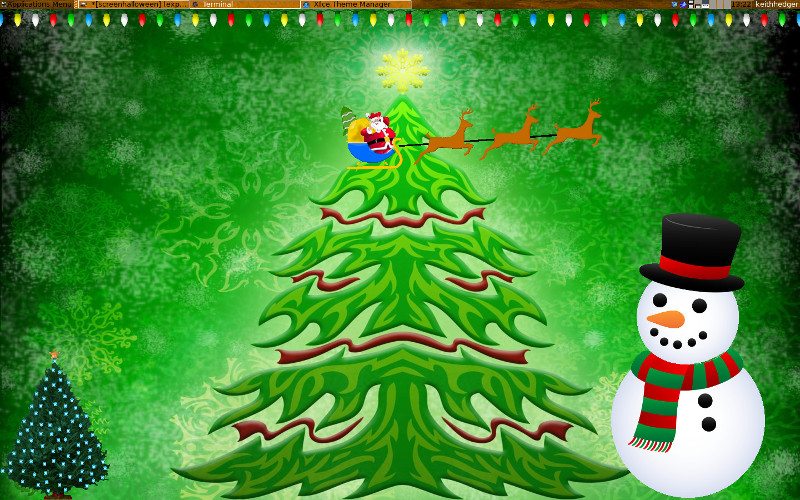

Some eye candy for the holidays, including lights, trees, snowmen, pumpkins, flying sleighs and witches, snow and autumn leaves.

This is along the lines of xsnow/xpenguins, and allows you to set themeable decorations on the desktop, you can choose ( at the moment ) either Halloween or Xmas themes or you can add your own.
You can set the speed of the various parts of the theme and their positions, either from the command line or from a config file, ( there is a documented default config file included ).

This works with a number of different WM's, but please see the INSTALL file for details on building/running and some work arounds.

Please see the INSTALL file for basic usage and the documented .rc config file.

Go to my webpage to see some short movies of XDecorations in action with config files.

To run without installing set the -data otions like so (presuming you are in the main XDecorations folder):
XDecorations/app/xdecorations -data XDecorations/resources/pixmaps/

XDecorations usually runs below other windows but if you want it on top use the -ontop option.

